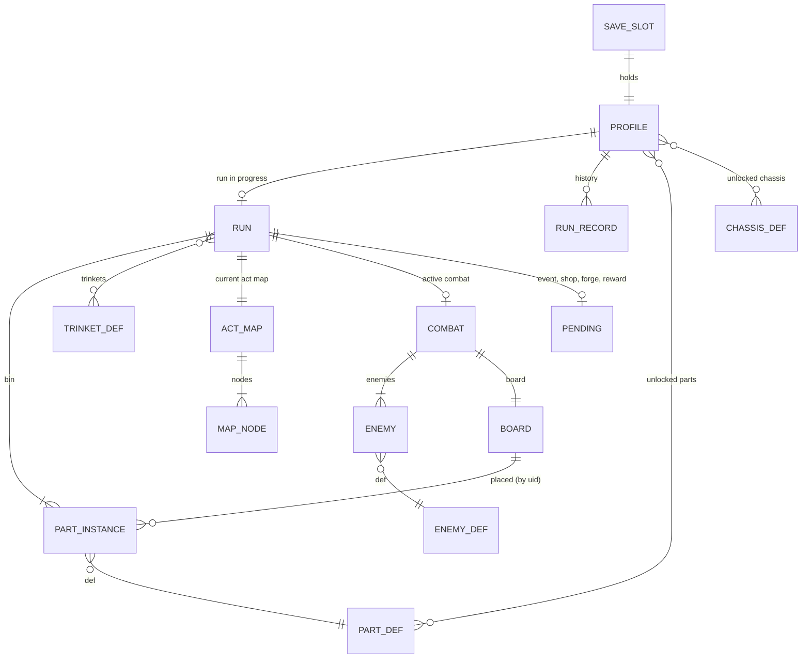

# Clockwork Spire: data model

The first contract of the build. **Definitions** (parts, enemies, trinkets, events, chassis, upgrades) are static TypeScript data shipped with the game, keyed by string id. **State** (profiles, runs, combats) is plain JSON-serializable data that references definitions by id, so it saves to IndexedDB as is and migrates by version. Rules are pure functions over state in `src/core/`.

## Diagram



## Definitions (static)

```ts
type Family = 'gear' | 'spring' | 'cam' | 'tempo' | 'steam' | 'chime';
type Rarity = 'common' | 'uncommon' | 'rare';

interface PartDef {
  id: string; name: string; family: Family; rarity: Rarity;
  locked: boolean;               // starts outside the run pool
  text: string; textPlus: string; // tooltip text, base and upgraded
  holds?: (ctx: TickCtx, p: PlacedPart) => boolean;  // default: passes
  threshold?: number; thresholdPlus?: number;        // springs, cams
  onFire(ctx: TickCtx, p: PlacedPart): void;         // the effect; pushes events
  onTurnStart?(ctx: TurnCtx, p: PlacedPart): void;   // torsion release
  onEnemyAttack?(ctx: CombatCtx, p: PlacedPart, enemyIdx: number): void; // trap
  onNeighborRelease?(ctx: TickCtx, p: PlacedPart, src: PlacedPart): void; // trip hammer, recoil
  diagonal?: boolean;            // bevel
}
interface EnemyDef { id; name; act: 1|2|3; tier: 'normal'|'elite'|'boss'; hp: number;
  pattern: IntentStep[] | ((e: EnemyState, c: CombatState, rng: Rng) => Intent); phases?: PhaseDef[]; }
interface TrinketDef { id; name; rarity: Rarity|'boss'; text; hooks: Partial<TrinketHooks>; }
interface EventDef { id; title; lines: string[]; act?: 1|2|3; sprocket?: boolean;
  choices: { label; detail; available?(run): boolean; apply(run, rng): EventOutcome }[]; }
interface ChassisDef { id; name; startingBin: string[]; passive: string; unlock: UnlockRule; }
interface UpgradeDef { id; name; costs: number[]; effect: string; }
```

Hooks are code, but every effect also reads its numbers from the def, so the balance simulator and tooltips use one source.

## State (saved)

```ts
interface SaveSlot { slot: 1|2|3; version: number; profile: Profile; run: RunState | null; updatedAt: string; }

interface Profile {
  name: string; createdAt: string;
  brass: number; brassEarnedTotal: number;
  blueprints: string[];            // part ids unlocked by blueprint
  upgrades: Record<string, number>; // upgrade id -> level bought
  chassisUnlocked: string[];
  runsStarted: number; wins: number; bestFloor: number; // floor counted 1..39 across acts
  history: RunRecord[];            // newest first, capped at 100
  storyFlags: string[];            // Workshop notes seen, events seen
  lastSprocketMood: 'celebrate'|'happy'|'comfort'|null;
}

interface RunRecord { n: number; seed: number; chassis: string; result: 'win'|'loss'|'abandoned';
  act: number; floor: number; killedBy?: string; brassEarned: number; blueprintsFound: string[];
  partsAtEnd: string[]; trinkets: string[]; turns: number; biggestTurn: number; endedAt: string; }

interface RunState {
  seed: number; rng: Record<RngStream, number>; // stream states: map, draw, enemy, reward, event, shop
  chassis: string; act: 1|2|3; floor: number;     // floor 1..13 within the act
  hp: number; maxHp: number; cogs: number;
  bin: PartInstance[]; trinkets: string[];
  map: ActMap; nodeId: string | null;            // where you stand
  phase: 'map'|'combat'|'reward'|'event'|'shop'|'forge'|'oil'|'victory'|'defeat';
  combat: CombatState | null; pending: Pending | null;
  stats: { turns: number; biggestTurn: number; elites: number; bossesBeaten: number; brassEarned: number; blueprintsFound: string[] };
  flags: { secondWindUsed: boolean; [k: string]: boolean };
}
interface PartInstance { uid: number; defId: string; plus: boolean; }

interface ActMap { act: number; nodes: MapNode[]; }
interface MapNode { id: string; floor: number; lane: number; type: 'fight'|'elite'|'event'|'forge'|'oil'|'shop'|'boss'; next: string[]; visited: boolean; }

interface CombatState {
  kind: 'fight'|'elite'|'boss'; turn: number; ticksThisTurn: number;
  board: (PlacedPart | null)[];      // 15 cells, index = row*5 + col; index 5 (A2) is the Mainspring
  hand: number[]; draw: number[]; discard: number[]; // part uids
  placementsLeft: number; swapUsed: boolean;
  plating: number; pressure: number; momentum: number;
  playerStatuses: Record<string, number>;
  enemies: EnemyState[]; targetIdx: number;
  lastTurnContrib: Record<number, { value: number; fedBy: number | null }>; // uid -> output, for Rewind and Echo Sprite
  log: TurnSummary[];
}
interface PlacedPart { uid: number; defId: string; plus: boolean; charge: number; counter: number; rusted: number; magnetized: boolean; firedThisTurn: number; }
interface EnemyState { defId: string; hp: number; maxHp: number; shell: number; statuses: Record<string, number>;
  intent: Intent; step: number; phase?: number; mem: Record<string, number>; }
type Intent = { kind: 'attack'|'defend'|'buff'|'debuff'|'sabotage'|'charge'|'summon'|'special'; amount?: number; hits?: number; target?: number; label: string };
type Pending = { kind: 'reward'; cogs: number; parts: string[]; trinket?: string; blueprint?: string }
             | { kind: 'event'; eventId: string; result?: string }
             | { kind: 'shop'; stock: ShopItem[]; removalUsed: boolean }
             | { kind: 'forge' } | { kind: 'oil' };
```

## Not saved (derived each time)
- The preview (simulate the turn on a copy).
- The event timeline being animated.
- Settings live in a separate global record `settings` (volume per channel, mute, animation speed, color-blind icons, reduced motion), not in a slot.

## Lifecycles
- **Save slot:** empty -> created (name, Tinker unlocked) -> played -> deleted (with a confirm).
- **Run:** started from the Workshop (pick chassis) -> map -> node (combat | event | shop | forge | oil) -> back to map -> boss -> next act ... -> `victory` or `defeat` -> a RunRecord is written and Brass and blueprints are added to the profile in the same save write -> `run = null` -> Workshop.
- **Combat:** created from a node with enemies and a shuffled draw pile -> turns (draw, build, run, enemies act) -> won (reward pending) or lost (run defeat). The board clears at the end.
- **PartInstance:** created by reward, event, shop or chassis -> may be upgraded (`plus`) or removed -> lives until the run ends. `uid`s are never reused within a run.

## Invariants (checked by unit tests)
1. Board index 5 is always the Mainspring; no PlacedPart is ever written there.
2. Every uid in board, hand, draw and discard is in the run's bin exactly once across those four places during combat.
3. `0 <= hp <= maxHp`; `pressure` in 0..30; charges and counters are non-negative.
4. A run's random results depend only on its seed and the player's choices (same choices, same run).
5. Brass and blueprints are added to the profile in the same write as the RunRecord, before any celebration plays, so a crash during the ending never loses them.
6. A save that fails to parse or migrate is never overwritten: it's kept as `slot-N-corrupt` and the slot shows a repair message.

## A run walked through the model
1. **Workshop, slot 1.** Profile: brass 0, upgrades {}, chassisUnlocked ['tinker'], history []. Player taps Climb, picks Tinker. A `RunState` is created: seed 81723, hp 50/50, cogs 0, bin = 8 PartInstances (uids 1..8), act 1 map generated from the `map` stream, `phase: 'map'`. Saved.
2. **Floor 1, fight.** Node chosen -> `CombatState` with Rust Mite x2 (enemy stream), draw pile shuffled (draw stream). Turn 1: hand [3, 5, 1] (Spur, Escapement, Spur). Player places Spur at B2 and Escapement at A1? No: A1 is adjacent to the Mainspring (A2), so yes. Preview: 3 ticks x (Strike 3 + Plate 3) = 9 damage, 9 Plating. Run: events stream to the renderer; the target Mite takes 9 and dies at 14? No: it has 14, takes 9, survives at 5. Enemies attack 5 + 5 = 10, Plating 9 absorbs 9, hp 49. Saved after each placement and after the turn.
3. **Turn 3, a Mite's sabotage.** Intent "Rust B2" highlights the Spur. Next turn it is `rusted: 1`; motion stops there, so the player places an Idler at A3 to route around. The preview shows the new path.
4. **Reward.** `pending: {kind:'reward', cogs: 15, parts: ['cam','leaf','bevel']}`. Player picks Cam: new PartInstance uid 9. Saved.
5. **Floor 4, event `sprocket-blueprint`.** Choice 1: blueprint `sprocket-wheel` goes into `run.stats.blueprintsFound` (and the profile at run end).
6. **Floor 7, forge.** Upgrade uid 9 (Cam -> Cam+).
7. **Floor 9, elite Gearhound.** Its Magnetize sets `magnetized` on the Coil Spring with 2 charge; at turn start it returns to hand and its charge is lost. Victory: trinket choice (Oilcloth), blueprint `ratchet`.
8. **Floor 13, the Foreman.** Player dies at 0 HP on turn 6. `phase: 'defeat'`. One write: RunRecord {result: 'loss', act 1, floor 13, brassEarned: 4 x 12 + 10 + 0 = 58, blueprintsFound: ['sprocket-wheel','ratchet']}, profile.brass += 58, blueprints += 2, bestFloor 13, `run = null`.
9. **Workshop.** Sprocket's mood: bestFloor rose (new best) but act 1 death -> `happy` (a new best counts as a good climb). Player buys Reinforced Frame I (40). Next run starts with 55 max HP and two more parts in the pool.

Found while walking it: `lastTurnContrib` is needed for Rewind and Echo Sprite; `magnetized` must drop the part's charge; `bestFloor` must count across acts (act 2 floor 3 = 16); the RunRecord needs `killedBy` for the history screen.
