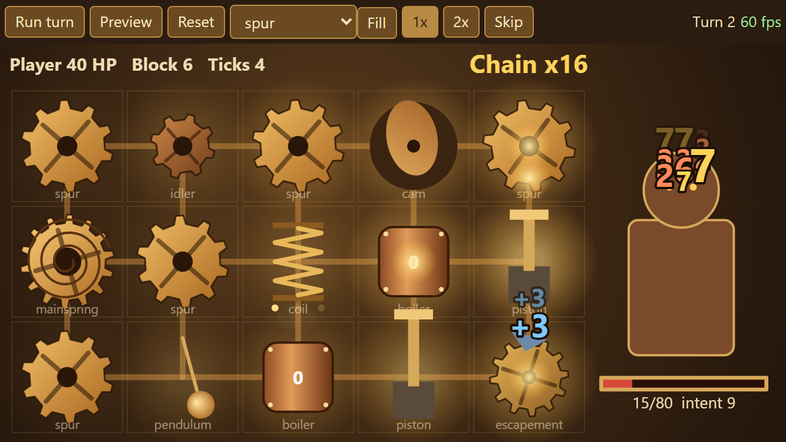

# Spike: machine simulation and animation

**Question.** Can a pure, deterministic TypeScript machine simulation drive (1) an exact preview, (2) a satisfying 60 fps Canvas 2D replay on desktop and phone sizes, and (3) a headless balance simulator fast enough to play thousands of runs, without the sim and the animation drifting apart?

**What was built** (throwaway, in `spike/`, about 650 lines): a 5 by 3 board with the Mainspring at A2, breadth-first motion in fixed neighbor order, eight prototype parts (spur, idler, coil, cam, boiler, piston, pendulum, escapement), a dummy enemy. `simulateTurn(state, rng)` returns the next state and a flat event list (`pulse`, `power`, `damage`, `block`, `charge`, `release`, `heat`, `tickAdded`, `attack`), each event tagged with its tick and breadth-first step. `preview(state)` runs the same function on a copy. The renderer replays only the event list: toothed gears that counter-rotate when powered, a coil that compresses and snaps, a cam, a boiler with glow and steam puffs, a piston stroke, a swinging pendulum, pulses traveling along the links, damage popups and a chain counter. Speed 1x, 2x, skip.

## Results
| Measure | Result |
|---|---|
| Headless speed | 100,000 turns in 1.63 s (about 61,000 turns per second, one core, about 175 events per turn) |
| Implied full runs | about 300 complete runs per second per core (200 turns per run). A 200-career report of about 12 runs each is about 8 s of pure simulation before bot search costs. |
| Determinism | same seed twice: identical hash over all 100,000 event lists; a different seed: a different hash |
| Frame rate 1280x800 | 60.0 fps average, 1% worst 16.8 ms, no dropped frames (headless Chromium, DPR 2, full board running back to back) |
| Frame rate 667x375 | 60.0 fps average, 1% worst 16.8 ms, no dropped frames |
| Page errors | none |

## What it proves and what it doesn't
- **Proven:** the timeline approach works. The renderer never re-runs rules, so the animation cannot disagree with the result, and the preview is the same function on a copy, so it is exact. Determinism holds. Speed leaves room for the bot's search: a greedy bot tries about 90 placements per turn, so a full balance report costs minutes, not hours; tests use smaller samples (see `docs/acceptance.md`).
- **Not proven:** real phone GPU headroom (headless rendering was locked to vsync, so it shows the frame fits in 16.7 ms, not by how much). Mitigation: DPR cap 2, particle cap, and a "reduced effects" setting; the critic checks on a phone-size viewport each build phase.
- **Lessons for the real build:**
  - Tag every event with tick and breadth-first step; the replay schedules by them.
  - Text in the canvas (part labels, popups) is readable at 667 by 375 only at large sizes; part names and tooltips move to DOM, the canvas keeps numbers and effects.
  - The bot needs preview calls to be cheap: avoid structured clone per preview in the hot path (hand-written copy of the small combat state), worth about 2x.

## Decision
Adopt D-006 (pure TS sim + Canvas 2D stage + Preact DOM UI, Vite). The spike's code is not reused; `src/core/` is written fresh against `docs/rules.md` and `docs/data-model.md`.
